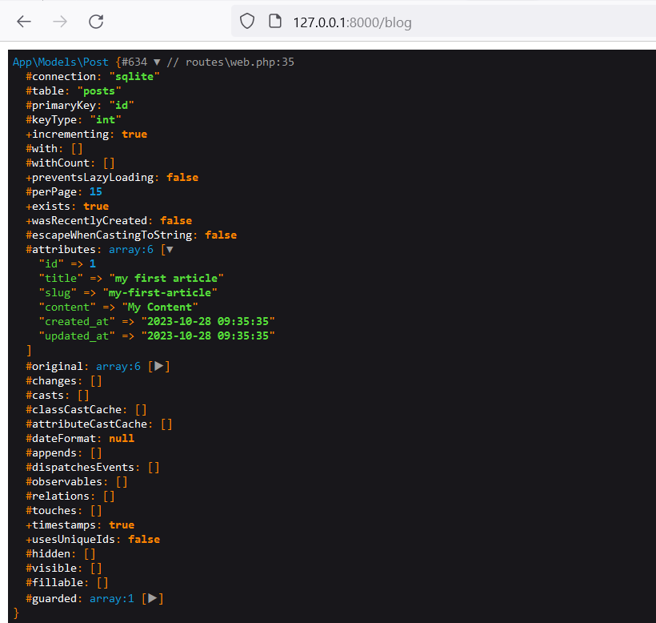
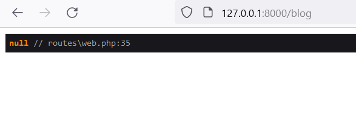
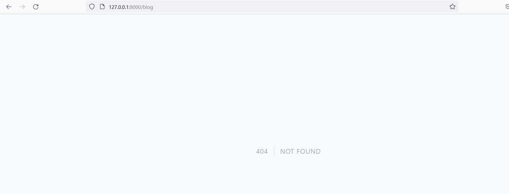
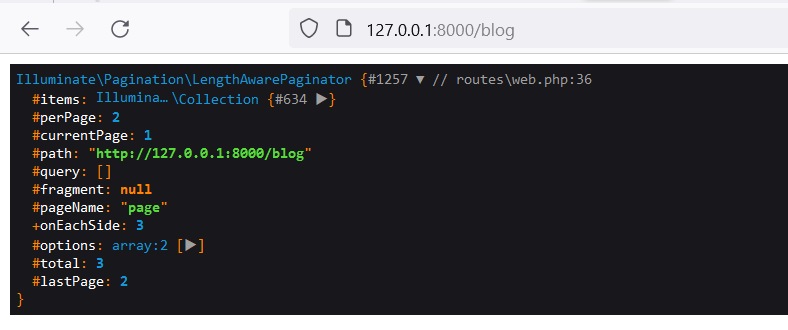
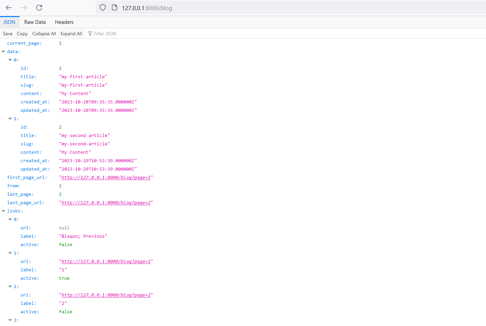
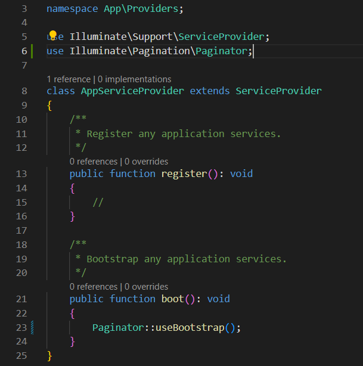
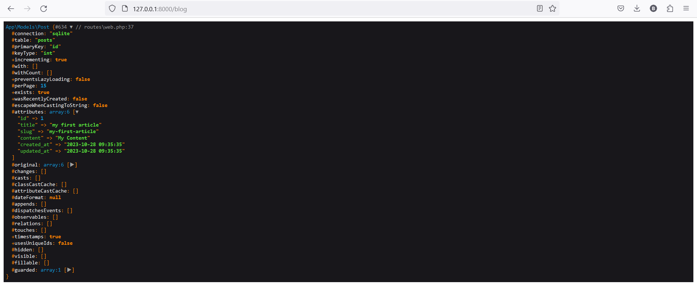
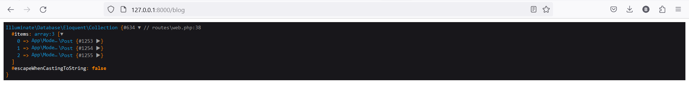

# About this Chapter

In this chapter, we'll explore the art of communicating with a database using Laravel and its ORM, Eloquent.<br>
ORM stands for Object Relational Mapping, which refers to classes enabling us to interact with database data and represent them as objects.<br>
As you'll soon discover, once you grasp the underlying principle, using it is remarkably straightforward<br>

## Migration

In our case, we want to be able to interact with our database to create an article system. We'll have to start by creating the table and the different fields needed and we won't necessarily need to use SQL. The Laravel migration system can be used.<br>
**_To do this, we're going to go to the terminal and we're going to type the command:_**

```bash
php artisan make:migration CreatePostTable
```

-   **_You can change `CreatePostTable` with the name of your table_**

This will create a migration file in the folder. database/migration which will make it possible to add information to our database.<br>
The migration file will contain two methods, one method up which explains how to generate the tables<br>
And the fields and a method down which will make it possible to go back.<br>

```php
<?php

use Illuminate\Database\Migrations\Migration;
use Illuminate\Database\Schema\Blueprint;
use Illuminate\Support\Facades\Schema;

return new class extends Migration
{
    public function up(): void
    {
        Schema::create('posts', function (Blueprint $table) {
            $table->id();
            $table->string('title');
            $table->string('slug')->unique();
            $table->longText('content');
            $table->timestamps();
        });
    }

    public function down(): void
    {
        Schema::dropIfExists('posts');
    }
};
```

This migration system makes it possible to interact with the creation of the tables with a PHP API rather than having to write SQL.<br>
This adapts regardless of the database management system you use.<br>

Once we're satisfied, we're going to be able to start our migration.<br>
To do this, again, it will be necessary to go to the terminal and the command will be typed.<br>

```bash
php artisan migrate
```

### Models

1. why we need models
If we then look at the content of this database, we'll see that there are our different tables, and we have the table. posts which will contain the fields which have been requested.
   <p>So that's it to create tables but that's not enough for us, we would like to be able to retrieve or save information .</p>
   <p>To do that we have an other component intervenes which are models and we can add it using next command :</p>

```bash
php artisan make:model Post
```

-   **_You can change `Post` with the name of your Model_** <br>
    > note that we can ask laravel to create model and the migration at the same time by adding a dash m :

```bash
php artisan make:model Post -m
```

**_this will create a model file for us located in_** **app\Models\Post.php** <br> 2. Model usage :

<p>Here the first model view after running the command </p>

```php
<?php

namespace App\Models;

use Illuminate\Database\Eloquent\Factories\HasFactory;
use Illuminate\Database\Eloquent\Model;

class Post extends Model
{
    use HasFactory;
}
```

-   **namespace App\Models;:** This line defines the namespace of the class. In this case, the class Post belongs to the App\Models namespace. Namespaces are used to avoid naming conflicts between different parts of your application.

-   **use Illuminate\Database\Eloquent\Factories\HasFactory;:** This line imports the HasFactory trait from the Illuminate\Database\Eloquent\Factories namespace. Traits are a way to share methods among classes. In this case, the HasFactory trait provides methods to create model factories in Laravel.

-   **use Illuminate\Database\Eloquent\Model;:** This line imports the Model class from the Illuminate\Database\Eloquent namespace. The Model class is a fundamental class for Eloquent models in Laravel. It provides methods and features for interacting with the database.

-   **class Post extends Model:** This line defines the Post class, which extends the Model class. In object-oriented programming, "extends" is used to indicate that a class is inheriting properties and methods from another class. Here, Post inherits functionality from the Laravel Model class.

-   **use HasFactory;:** This line uses the HasFactory trait in the Post class. By including this line, the Post model can use methods provided by the HasFactory trait. Traits in PHP are similar to classes, but they group functionality in a fine-grained and consistent way.
    > **_now let play with our Model using Routes :_**
-   we are going to make a small concrete example we are going to go in `web.php` and we will go to the root route of the blog
    > Now we have the possibility of creating a new article by :

```php

Route::prefix('blog')->group(function(){
        Route::get('' , function(Request $request){

            $post = new \App\Models\Post;
            $post->title = 'my first article';
            $post->slug = 'my-first-article';
            $post->content = "My Content";
            $post->save();
            return $post;

            return[
                "link" => \route('blog.show' ,["slug" => "article" , "id" => 13])
            ];
        })->name("index");
        Route::get('/{slug}/{id}' , function(string $slug , string $id , Request $request){
            return[
                "slug" => $slug,
                "id" => $id
            ];
        })->name('blog.show');
});

```

```php
$post = new \App\Models\Post;
```

> This line creates a new instance of the Post model. The `new` keyword is used to instantiate a new object of a class.<br> `\App\Models\Post `specifies the fully qualified namespace of the `Post` model, indicating its location in the `App\Models` namespace.<br>

``` php
$post->title = 'my first article';
``` 
This line sets the title attribute of the `$post` object to the string 'my first article'.

``` php
$post->slug = 'my-first-article';
``` 
This line sets the slug attribute of the `$post` object to the string 'my-first-article'.

``` php
$post->content = "My Content";
``` 

This line sets the content attribute of the `$post` object to the string "My Content".

``` php
$post->save();
``` 

This line saves the $post object to the database. The `save()` method is provided by Eloquent, Laravel's ORM, and it inserts a new record into the corresponding database table.

``` php
return $post;
``` 

Finally, this line returns the `$post` object, which now represents the saved post in the database, including its unique identifier (id) generated by the database.
> in addition to show all data from our database tables we have a perfect method to fetch all data , and this method is `all()`:
``` php
    return \App\Models\Post::all();
``` 
- **::all()** : is an Eloquent method that fetches all records from the corresponding database table (`posts` in our case) and returns them as a collection of `post` model instances.

> more over we can specify which data we want to get from database table inside the all method for example:
``` php
   return \App\Models\Post::all('id','title');
``` 
- **::all(`'id'` , `'title'`)** : in this situation we call for all data defined inside `id` and `title` table columns
> sometimes we need to debug on our code to see our upcoming data , in this situation we can use **dd()** method:
```php
dd($post[0]->title);
```
- **dd($post[0]->title) :** in this line we print the title of index 0 from comming table data 

> in addition to `all()` method we also have other methods which are interestingg . we have a method which allow us to retrieve a particular article <br> And this method is called `find()` we do find and we give it the ID of the article taht we want to retrieve

```php
$post = \App\Models\Post::find(1);
dd($post);
return $post;
```
- `dd($post);` : 
 - we use it to debug on our code and see the data result as collection here is an example if `find(1)` find the data :
  - dd debug if we find result:
  

 - an example if we don't find a result :
  - dd debug if we don't find a result :
    
**=>** *we also have a method called `findOrFail()` and it make same role of `find()` but the different is on how result showed :*
```php
$post = \App\Models\Post::findOrFail(1);
dd($post);
return $post;
```
- `dd($post);` : 
 - we use it to debug on our code and see the data result as collection here is an example if `find(1)` find the data :
  - dd debug if we find result:
  
 - an example if we don't find a result :
   -dd debug if we don't find a result:
   
**=>** ***we can use it if we not want to execute rest of the code if it has not found the records.
**==>** *Another interesting point is that we have the option to implement pagination for the listing.<br> We can achieve this by using the `paginate()` method and setting a limit to display 'n' number of records per page ,Here is an example:*
```php
$post = \App\Models\Post::paginate(2);
```
> than if we check the result we will get data us **LengthAwarePaginator** and this is somthing that could be used both in the views but also in the API part to generate paginations .
- `dd($post);` : 
 - we use it to debug on our code and see the data result as collection here is an example if `paginate(2)` find the data :
  - dd debug result:
   
  - pagination result as an JSON file :
  

> **Note : to make pagination methdod work you need to go to app folder tan to providers than to AppServiceProvider.php and add the following code**
```php
use Illuminate\Pagination\Paginator;
paginator::useBootstrap();
```
- here is an example :
 - AppServiceProvider.php example : 
 

**Also we can define specific data that we can get inside the pagination using this code :**
```php
$post = \App\Models\Post::paginate(1 , ["id","title"])
```
> **Note that we have the possibility of using the querybuilder which will allow us to design queries , so we can design specific queries starting in particular from the model , for example we want to put conditions on join or this type of thing we will have methods which have an I which is greater than 0 , so i can do that by running the code bellow :**
```php
$post = \App\Models\Post::where('id' , '>' , 0)->first();
dd($post);
return $post;
```
- `where()`: ***we use it to get data where id greater than 0 ***
- `first()`: ***we use it to get the first element of data we got from `where()` method***
- `dd($post)` : ***result***


> **Also we can use same method of `where()` and `get()` method to get all element :**
```php
$post = \App\Models\Post::where('id' , '>' , 0)->get();
dd($post);
return $post;
```
- `get()`: ***we use it to get the all element of data we got from `where()` method***
- `dd($post)` : ***result***


> **Also we have a queryBuilder method called `limit()` and we can use it to get a limit number of data :**
```php
$post = \App\Models\Post::where('id' , '>' , 0)->limit(1);
dd($post);
return $post;
```
- `limit()`: ***we use it to get limited number of data we got from `where()` method***
- `dd($post)` : ***result***
