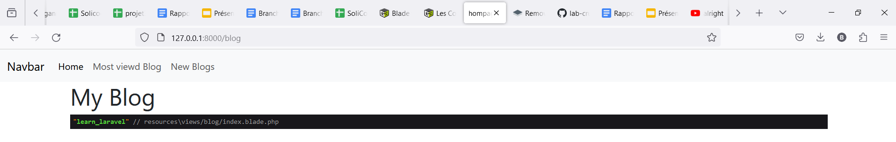
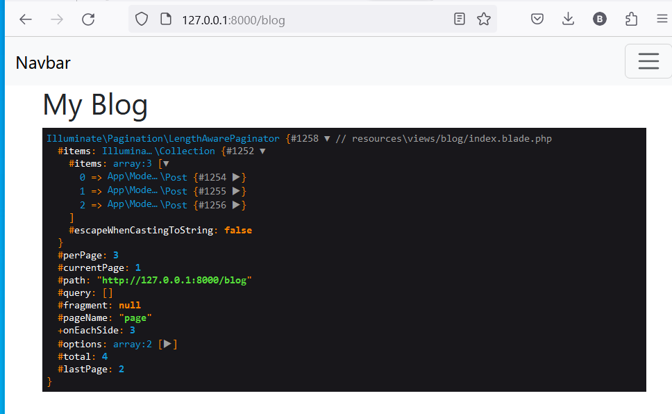
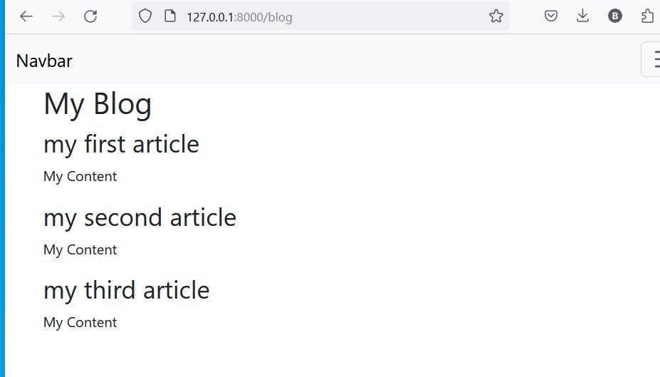
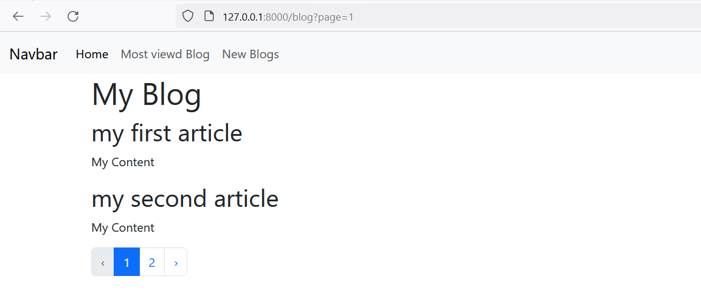

# About this tutorial

In this chapter we're going to discover the part seen in the MVC structure. Laravel has a template engine that will allow us to generate HTML views more simply.
> we may ask ourselves why we would not simply use php , the problem is that with views written in php it is not very practical to use a template system or to include sections and all that we have to complicate our lives a little bit and that's why blade will be useful 

- The blade views will be created in files with the extension `.blade.php` and the variables can be displayed using braces.
```php
{{ $username }}
```
## Example :

- Suppose we want to display a list of our articles:
> ***By default, we might tend to create a new page in the view resources folder. For instance, we would create a new file in a `blog` folder to encompass everything related to the blog and name it `index.blade.php`.***

`blade.php`: The `Blade` point is crucial, it allows us to specify that we are going to use the Laravel template engine.

- `index.blade.php` example :

```php
<!DOCTYPE html>
<html lang="en">
<head>
    <meta charset="UTF-8">
    <meta name="viewport" content="width=device-width, initial-scale=1.0">
    <title>My blog</title>
</head>
<body>
    <h1>My Blog</h1>
    
</body>
</html>
```
- One thing to note is that all this part:
```php
<!DOCTYPE html>
<html lang="en">
<head>
    <meta charset="UTF-8">
    <meta name="viewport" content="width=device-width, initial-scale=1.0">
    <title>My blog</title>
</head>
<body>
```
> *this part is common to all pages. It's somewhat inconvenient to see it systematically repeated. If we create a page to view an article, we would have the same structure.*

To avoid the hassle of repeating this structure, we can create a template at the root of the view folder, naming it `base.blade.php`. This template will include the repeated HTML code and the <div> where we will add our data.

```php
<!DOCTYPE html>
<html lang="en">
<head>
    <meta charset="UTF-8">
    <meta name="viewport" content="width=device-width, initial-scale=1.0">
    <title>My blog</title>
</head>
<body>
    <div class="container">
        @yield('content')
    </div>
</body>
</html>
```
- `@yield('content')`: This will be used to place the data from `index.blade.php`.
> Let try To change the webpage title using `@yield()`:
```php
<title>@yield('title')</title>
```
1. `@yield('title')` => will be used to capture data that we want to insert inside it.

```php
<!DOCTYPE html>
<html lang="en">
<head>
    <meta charset="UTF-8">
    <meta name="viewport" content="width=device-width, initial-scale=1.0">
    <title>@yield('title')</title>
</head>
<body>
    <div class="container">
        @yield('content')
    </div>
</body>
</html>
```
2. so to do that we will go to `base.blade.php` and add `@section('title','Blog HomePage')`:

- `@section('title', 'Custom Page Title')`: This Blade directive starts a new section named `'title'` and sets its default content to 'Custom Page Title'.

> To do that we need to update our `index.blade.php`:

```php
@extends('base')
@section('title' , 'hompage')
@section('content')
    <h1>My Blog</h1>
@endsection
```

- `@extends('base')`: This line indicates that this Blade view extends the `base.blade.php` layout. It means the content of this view will be placed inside the `@yield('content')` section of the `base.blade.php` file.

- `@section('title', 'hompage')`: This line defines a section named `'title'` with the content `'homepage'`. It sets the title for this specific page. When this view is rendered, the `'title'` section in the `base.blade.php` file will be replaced with `'homepage'`.

- `@section('content')`: This line starts a new section named `'content'`. Any content you define between `@section('content')` and `@endsection` will be placed inside the `@yield('content')` section of the `base.blade.php` file.

- `<h1>My Blog</h1>`: This is the content of the `'content'` section. In this case, it's an <h1> heading displaying "My Blog". This content will replace `@yield('content')` in the `base.blade.php` file.
## Displaying HTML Text Using Blade :

When it comes to displaying information on our webpage, we often need to handle HTML content safely and efficiently. In PHP, we traditionally echo HTML content using <?php echo "text"; ?>. However, in Laravel's Blade template engine, there are cleaner and safer ways to achieve this.
- **Using Double Braces {{ }}:**
```php
<?="text" ?>
```
> In Laravel's Blade template engine, you can display content using double braces {{ }}. Traditionally in PHP, content is displayed using <?php echo "text"; ?>. However, this approach doesn't escape characters, potentially causing issues if HTML is injected. Blade's double braces resolve this problem :
```php
{{text}} 
{{$text}}
```
- The key advantage of these double braces is automatic HTML escaping. When you use `{{ $text }}`, any special characters in the variable are converted into HTML entities. This prevents injection problems, ensuring security in your application.

- **Shortcuts for Loops and Conditions:**

Blade provides shortcuts for common tasks like loops and conditional statements. For example, looping through articles can be done using `@foreach`:

```php
<?php if(true):?>
{{'text'}}
<?php endif ?>
```
> Similarly, conditional statements are simplified with `@if`, `@else`, and `@elseif`:

```php
@if($condition)
    {{ 'text' }}
@elseif($anotherCondition)
    {{ 'another text' }}
@else
    {{ 'false' }}
@endif
```
> Debugging with `@dump`:

Blade offers a handy debugging tool called `@dump`. It allows you to inspect variables and their contents, providing insights into your application's data flow:

```php
@dump('learn_laravel')
```
- `@dump` displays the variable's content along with information about where it was loaded. It also uses color-coding for better readability, enhancing your debugging experience,Here is an example.



## Loop in laravel :

1. Basics of Passing Variables in Laravel Blade:

In our case, we want to list the articles. When calling a view, we can send variables to be used in the view for generating content. We will send the list of articles as a variable named 'posts' to the view, where 'posts' contains paginated articles.

```php
<?php

namespace App\Http\Controllers;
use App\Models\Post;
use Illuminate\Http\RedirectResponse;
use Illuminate\View\View;

class PostController extends Controller
{
    public function index():view{
        return view('blog.index',[
            'post'=>\App\Models\Post::paginate(2)
        ]);
    }
}
```

Now, if we go back to our `index.blade.php` and write `@dump($posts)`, We will get our list of articles.
```php
@extends('base')
@section('title' , 'hompage')
@section('content')
<h1>My Blog</h1> 
@dump($post)

@endsection
```
- `@dump($post)` result :


2. loop on a list and show result :

```php
@extends('base')
@section('content')
<h1>My Blog</h1>
@foreach($post as $posts)
<article>
<h2>{{$posts->title}}</h2>
<p>
{{$posts->content}}
</p>
</article>
@endforeach
```

- Result :


3. Display Paginated Data with Pagination Links

In the previous sections, we successfully retrieved paginated data. However, we haven't shown how to navigate through these pages. Let's integrate pagination links into our view:

```php
@extends('base')
@section('content')
<h1>My Blog</h1>
@foreach($post as $posts)
<article>
<h2>{{$posts->title}}</h2>
<p>
{{$posts->content}}
</p>
</article>
@endforeach
{{$post->links()}}
```
In this code, we've used `{{$post->links()}}` to display pagination links at the bottom of the page. These links allow users to easily navigate between different pages of articles, providing a seamless browsing experience.

- Here is the result after adding pagination :

