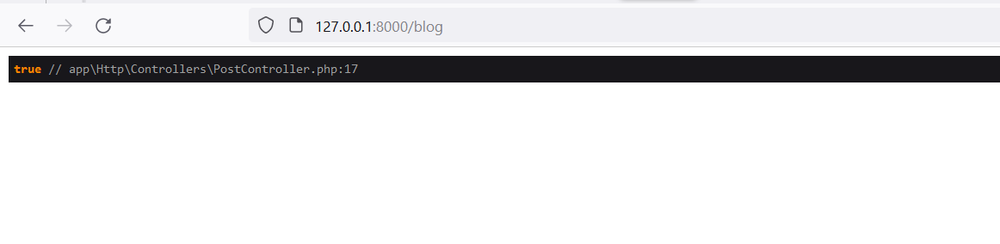
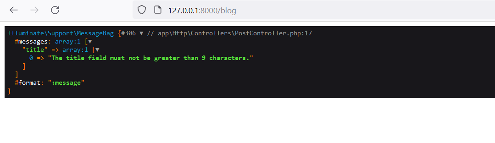

# Validate Data 

This new chapter will discover the validation part before approaching the management of the forms. It is important to ensure that the data sent to our application matches what is expected. To do this, Laravel offers us a class. `Validator` which will enable us to manage this operation.

## Data Validation in Laravel:

Suppose we want to validate data from an input named "title". To accomplish this, we'll work within the `PostController` and add a `validator` method.

```php
use Illuminate\Support\Facades\Validator;
```
1. `required|numeric` Rule :

With the `validator` method in place, let's use it within the `PostController` class, specifically inside the `index` action (function):

```php
<?php

namespace App\Http\Controllers;
use App\Models\Post;
use Illuminate\Http\RedirectResponse;
use Illuminate\Support\Facades\Validator;
use Illuminate\View\View;

class PostController extends Controller
{
    public function index():view{
    $validator = validator::make([
        'title'=>''
    ],[
        'title' => 'required|numeric'
    ]);
    dd($validator->fails());
        return view('blog.index',[
            'post'=>\App\Models\Post::paginate(1)
        ]);
    }
}
```
- Validation Setup:

Within the `index` method, a new instance of the `validator` is created using the `Validator::make` method.

The first argument is an array of data to be validated. Here, it contains a single element, 'title', with an empty string as a placeholder.
The second argument is an array of validation rules. In this case, it specifies that the 'title' field is `required` and must be `numeric`.

- Validation Check:

The `dd($validator->fails())` statement is used to check if the validation fails. `fails()` is a method provided by the `validator` that returns `true` if validation `fails`, indicating that the provided data does not meet the specified rules. If the validation fails, the application will halt and display the validation errors.

> Here is an example of the result : 


> Now, let's ensure that users cannot insert a value shorter than 3 characters :

2. `min` Rule :

```php
<?php

namespace App\Http\Controllers;
use App\Models\Post;
use Illuminate\Http\RedirectResponse;
use Illuminate\Support\Facades\Validator;
use Illuminate\View\View;

class PostController extends Controller
{
    public function index():view{
    $validator = validator::make([
        'title'=>''
    ],[
        'title' => 'required|min:3'
    ]);
    dd($validator->fails());
        return view('blog.index',[
            'post'=>\App\Models\Post::paginate(1)
        ]);
    }
}
```

- Validation Setup:

In the `validator::make` method, the second argument is an array of validation rules. Here, `'title' => 'required|min:3'` specifies that the `'title'` field is required and must have a minimum length of 3 characters `(min:3)`.

- Validation Check:

The `dd($validator->fails())` statement checks if the validation fails. If the input does not meet the defined criteria `(minimum length)`, `fails()` returns `true`, indicating validation failure.

> Now, let's ensure that users cannot insert a value longer than 8 characters :

3. `max` Rule :

In this code, the max validation rule in Laravel ensures that the 'title' input field contains a maximum of 8 characters. Here's how it works:

```php
<?php

namespace App\Http\Controllers;
use App\Models\Post;
use Illuminate\Http\RedirectResponse;
use Illuminate\Support\Facades\Validator;
use Illuminate\View\View;

class PostController extends Controller
{
    public function index():view{
    $validator = validator::make([
        'title'=>''
    ],[
        'title' => 'required|max:8'
    ]);
    dd($validator->fails());
        return view('blog.index',[
            'post'=>\App\Models\Post::paginate(1)
        ]);
    }
}
```

- Validation Setup:

In the `validator::make` method, the second argument is an array of validation rules. Here, `'title' => 'required|max:8'` specifies that the `'title'` field is required and must not exceed 8 characters `(max:8)`.

- Validation Check:

The `dd($validator->fails())` statement checks if the validation fails. If the input exceeds the defined maximum length (8 characters in this case), `fails()` returns true, indicating validation failure.

4. `errors` method :

the `errors` method is employed to retrieve a list of error messages associated with our validation process :

```php
<?php

namespace App\Http\Controllers;
use App\Models\Post;
use Illuminate\Http\RedirectResponse;
use Illuminate\Support\Facades\Validator;
use Illuminate\View\View;

class PostController extends Controller
{
    public function index():view{
    $validator = validator::make([
        'title'=>'laravel validation data'
    ],[
        'title' => 'required|max:8'
    ]);
    dd($validator->errors());
        return view('blog.index',[
            'post'=>\App\Models\Post::paginate(1)
        ]);
    }
}
```
- Validation Setup:

In the `validator::make` method, the second argument is an array of validation rules. Here, `'title' => 'required|max:8'` specifies that the `'title'` field is required and must not exceed 8 characters `(max:8)`.

- Validation Check:

`dd($validator->errors())` is utilized to dump and display the validation errors. If validation fails (for instance, if the title exceeds 8 characters in this case), the `errors` method will contain detailed error messages related to the validation failure
